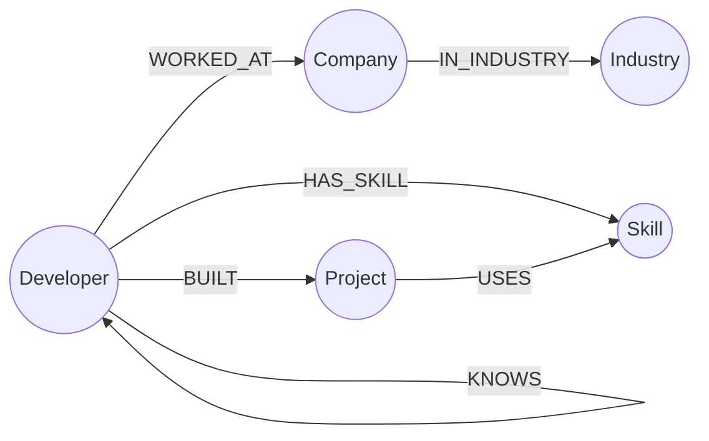
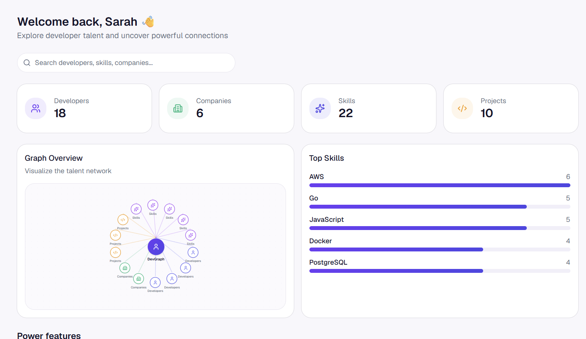
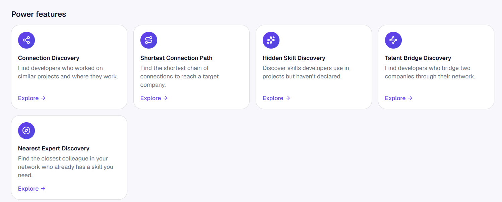
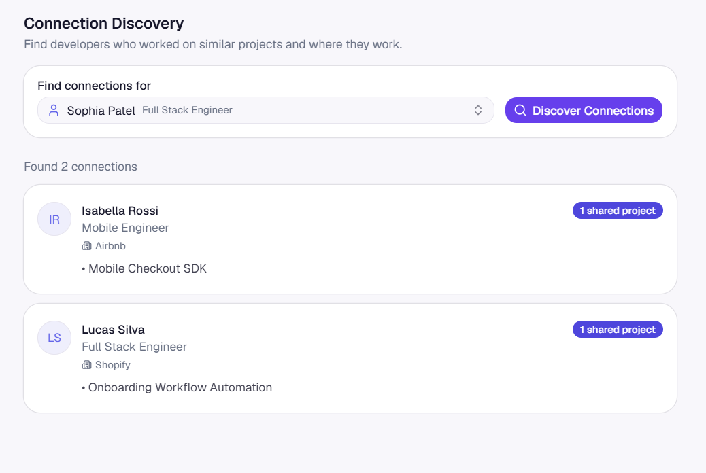
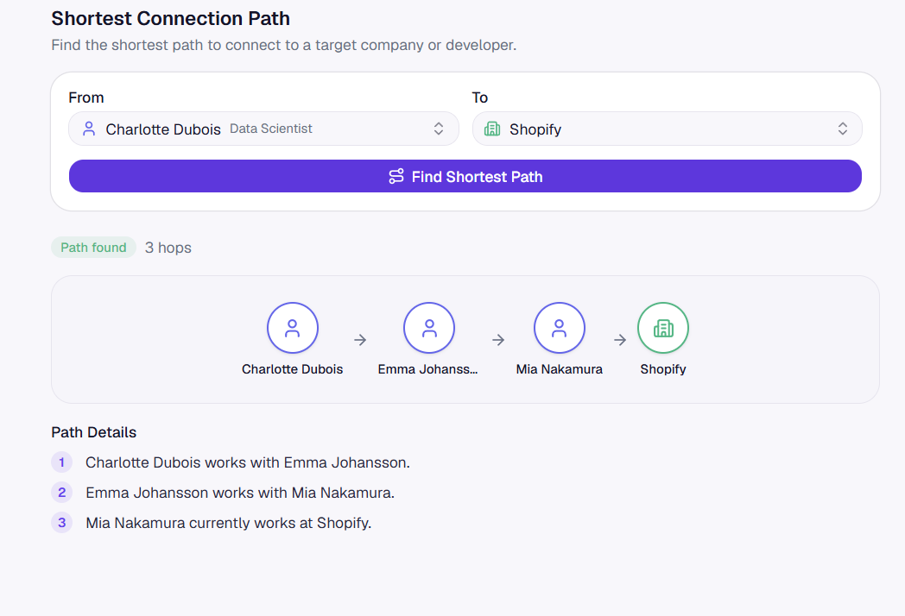
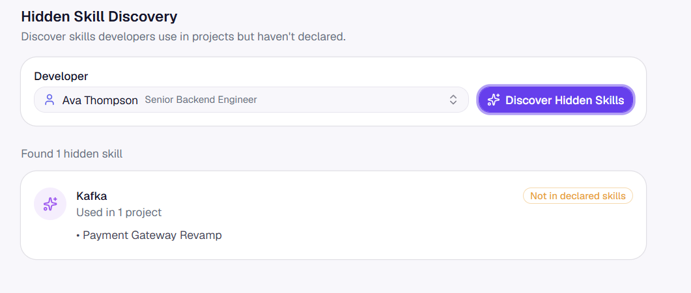
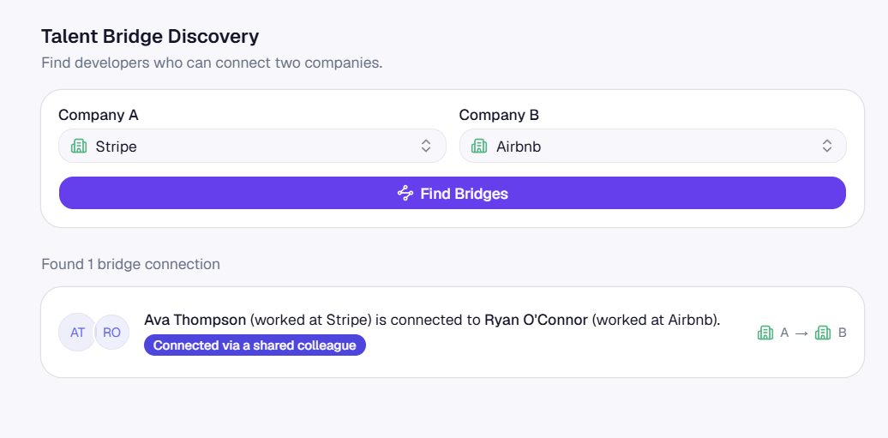
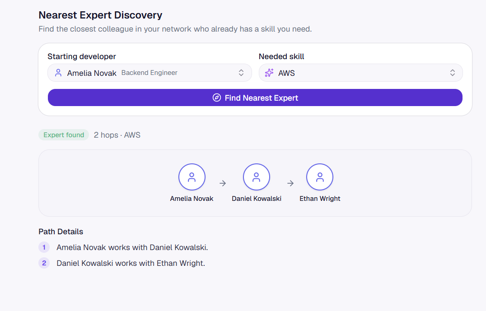

# DevGraph — Developer Talent Graph Explorer

A full-stack app that models a company's developer talent — people, the
skills they hold, the projects they built, the companies they've worked
at — as a **property graph** in CognoDB (a Bolt 5.x, Neo4j-compatible
graph database), and exposes five relationship-driven discovery features
on top of it through a Spring Boot API and a React UI.

**Live app:** [dev-graph-phi.vercel.app](https://dev-graph-phi.vercel.app/)
**API:** [devgraph-backend-odij.onrender.com](https://devgraph-backend-odij.onrender.com/)
*(the Render free-tier backend spins down when idle — the first request
after a while can take 30-60s to wake it up.)*

---

## Table of contents

- [The use case](#the-use-case)
- [Why a graph database?](#why-a-graph-database)
- [Data model](#data-model)
- [Setup and run instructions](#setup-and-run-instructions)
- [The main queries, explained](#the-main-queries-explained)
- [Screenshots](#screenshots)
- [Project layout](#project-layout)

---

## The use case

The idea started from watching how LinkedIn structures its data: people,
companies, skills and projects aren't independent rows in separate
tables — the *value* is in how they connect. "Who do I know who could
introduce me to someone at this company?", "Who on my team actually knows
this technology, even if it's not on their profile?", "What's the shortest
chain of people connecting me to that hiring manager?" — none of these are
naturally "look up a record" questions. They're all "traverse a network"
questions.

So instead of building another CRUD app over developer profiles, DevGraph
is structured explicitly around that network: developers, companies,
projects, skills and industries as nodes, and the *relationships between
them* — `WORKED_AT`, `BUILT`, `HAS_SKILL`, `USES`, `KNOWS`, `IN_INDUSTRY` —
as first-class edges you can query across. Five features fall directly out
of that structure:

1. **Connection Discovery** — colleagues from shared projects, and where
   they work now (`Developer → Project → Developer → Company`).
2. **Shortest Connection Path** — the shortest chain of colleagues linking
   a developer to a target company (`Developer →(KNOWS)*→ Developer →
   Company`).
3. **Hidden Skill Discovery** — technology a developer has demonstrably
   used on a project but hasn't declared as a skill.
4. **Talent Bridge Discovery** — the people who connect two companies,
   either by having worked at both or by knowing someone who did.
5. **Nearest Expert Discovery** — the closest colleague in your network
   who already holds a skill you need.

All five are "who is close to whom, and by what path" questions — the
kind of question a graph is built to answer directly, and a relational
schema has to work to reconstruct (see below).

## Why a graph database?

This isn't a blanket "graphs beat SQL" pitch — the honest answer is
*it depends on the feature*, and it's worth being precise about which of
these five actually need a graph engine versus which just read nicely as
one. (The full breakdown lives in
[`backend/docs/GRAPH_VS_SQL.md`](backend/docs/GRAPH_VS_SQL.md); summarized
here.)

### Where the graph database is doing real work

**Nearest Expert Discovery** and **Shortest Connection Path** both need a
traversal whose depth *isn't known in advance* — "follow `KNOWS` edges
until you reach X," where X could be 1 hop away or 8. Cypher's
`shortestPath()` does this natively, in one traversal, using index seeks
at each hop.

The relational equivalent is a **recursive CTE** that walks a
relationship/edge table level by level, tracks visited rows to avoid
cycles, and — for Nearest Expert specifically — evaluates a join
condition (`HAS_SKILL`) at *every* level instead of against one fixed
target id. That's not "slightly more SQL" — it's reimplementing a
piece of a graph engine inside a CTE, and no relational query planner
will turn that into an index-seek traversal the way a native graph store
does. The hop bound also has to be capped by hand (`maxHops`, validated
server-side here) or the recursion runs away. This is the one place in
the codebase where the graph database is a genuine technical necessity,
not a modeling preference.

| | Relational (recursive CTE) | Graph (`shortestPath`) |
|---|---|---|
| Unknown traversal depth | Hand-rolled BFS, level-by-level, cycle tracking | Native, one traversal |
| Mid-traversal join condition (Nearest Expert) | Re-evaluated every level inside the recursion | Just another pattern in the `MATCH` |
| Query plan | No index-seek traversal; cost grows with table scans per level | Relationship traversal is an index seek per hop |

### Where it's convenience, not necessity

**Connection Discovery** and **Talent Bridge Discovery** are *fixed-depth*
traversals — 3-4 hops, known ahead of time. In SQL these are a handful of
`JOIN`s (Talent Bridge is literally a `UNION` of two joins already,
mirroring the Cypher `CALL { ... UNION ... }`). A relational schema with
the right indexes handles both without real difficulty. The honest
justification here is ergonomics — relationships are first-class edges
you traverse, not join tables you have to design, name, and maintain — not
query-plan superiority.

**Hidden Skill Discovery**, as shipped, doesn't even use a single Cypher
query for its core logic — it runs two independent reads and computes the
set difference in application code (a CognoDB query-correlation quirk
forced that; see the class javadoc). The equivalent `LEFT JOIN ... WHERE x
IS NULL` in SQL would honestly have been simpler than what's here.

### The takeaway

If asked to defend the choice in one sentence: **the graph model is
strictly necessary for variable-depth traversal** (Nearest Expert,
Shortest Path), and **a convenient, more natural fit** for everything
else that's fundamentally "follow a relationship a few hops." Both are
real reasons to reach for a graph database for this domain — but they're
different strengths of claim, and it's worth knowing which one you're
making.

## Data model



| Node | Key properties |
|---|---|
| `Developer` | `id`, `name`, `title`, `location` |
| `Company` | `id`, `name` |
| `Industry` | `id`, `name` |
| `Project` | `id`, `name`, `description` |
| `Skill` | `id`, `name` |

| Relationship | Direction | Meaning |
|---|---|---|
| `WORKED_AT` | `Developer → Company` | employment history (a developer can have several) |
| `BUILT` | `Developer → Project` | a developer contributed to a project |
| `HAS_SKILL` | `Developer → Skill` | a skill declared on the developer's profile |
| `USES` | `Project → Skill` | a technology actually used on a project |
| `IN_INDUSTRY` | `Company → Industry` | the company's industry |
| `KNOWS` | `Developer → Developer` | a professional connection — stored one-directional per pair, queried as undirected (`-[:KNOWS]-`) |

`id` is a unique constraint on every node label (`cypher/01_constraints.cypher`),
enforced with `CREATE CONSTRAINT ... IS UNIQUE`.

## Setup and run instructions

### Prerequisites

- JDK 21+ (the bundled `./mvnw` wrapper handles Maven itself)
- Node 18+ and npm (for the frontend)
- A CognoDB / Neo4j-compatible instance reachable over Bolt (see below)
- Docker, optional, for containerized runs
- `cypher-shell`, optional, only needed for the standalone data-loading
  scripts in `scripts/`

### 1. Create a CognoDB instance

CognoDB is queried over the standard Bolt protocol via the official Neo4j
driver, so provisioning one looks like standing up any managed
Neo4j-compatible instance:

1. **Log in** to the CognoDB console.
2. **Create a new instance** from the dashboard.
3. **Choose the free tier** — plenty for this dataset (18 developers, 6
   companies, 22 skills, 10 projects — a few hundred nodes/relationships
   total).
4. Once it's provisioned, **copy the connection credentials** (Bolt URI,
   username, password) or **download the credentials file** the console
   offers — you'll need the URI (`neo4j+s://...` or `bolt://...`), the
   username (usually `neo4j`), and the generated password.
5. Wire those into the app via the official **Neo4j Java driver** — this
   project already does that in
   [`backend/src/main/java/com/devgraph/config/Neo4jConfig.java`](backend/src/main/java/com/devgraph/config/Neo4jConfig.java):
   a `Driver` bean built from `GraphDatabase.driver(uri, AuthTokens.basic(username, password), config)`,
   reading `uri`/`username`/`password` from environment variables
   (`cognodb.uri`, `cognodb.username`, `cognodb.password` in
   `application.yml`) so credentials never live in source control. If you
   were doing this from scratch in another language, this is the one
   piece to port — every official Neo4j driver (Java, Python, JS, Go, …)
   exposes the same `driver(uri, auth)` shape.

### 2. Configure and run the backend

```bash
cd backend
cp .env.example .env
# edit .env with the CognoDB URI/username/password from step 1
```

```bash
# bash/zsh
export $(grep -v '^#' .env | xargs)
./mvnw spring-boot:run

# PowerShell
Get-Content .env | ForEach-Object {
  if ($_ -match '^\s*([^#][^=]*)=(.*)$') { Set-Item "Env:$($matches[1])" $matches[2] }
}
.\mvnw.cmd spring-boot:run
```

The API listens on `http://localhost:8080`. Full endpoint reference, error
codes and architecture notes are in [`backend/README.md`](backend/README.md).

### 3. Load the sample data

Two independent ways to get the sample graph in — pick either:

- **Automatic**: set `DEVGRAPH_SEED_ENABLED=true` in `.env` before starting
  the backend; `seed.DataSeeder` merges the sample dataset in on startup
  (idempotent — safe to leave on across restarts).
- **Standalone Cypher**, independent of the app entirely — useful if you
  just want data in the database without running Spring Boot at all:

  ```bash
  ./scripts/load-data.sh bolt://<your-uri>:7687 neo4j <your-password>
  # or on Windows:
  .\scripts\load-data.ps1 -Uri bolt://<your-uri>:7687 -Username neo4j -Password <your-password>
  ```

  Credentials can also be set as `NEO4J_URI`/`NEO4J_USERNAME`/`NEO4J_PASSWORD`
  environment variables instead of passing them as arguments.

  This runs [`cypher/01_constraints.cypher`](cypher/01_constraints.cypher)
  then [`cypher/02_seed_data.cypher`](cypher/02_seed_data.cypher) via
  `cypher-shell`. Both files can also just be pasted into Neo4j Browser or
  the CognoDB console's query editor directly.

### 4. Configure and run the frontend

```bash
cd frontend
cp .env.example .env
# VITE_API_BASE_URL=http://localhost:8080 (or your deployed backend URL)
npm install
npm run dev
```

The app runs on `http://localhost:5173` by default (Vite).

### 5. Docker (optional)

The backend ships a `Dockerfile` (`backend/Dockerfile`); `render.yaml`
documents the production deploy shape (Render for the API, healthcheck at
`/actuator/health/readiness`). The frontend deploys as a static Vite build
(Vercel, see `frontend/dist`).

## The main queries, explained

All five live as parameterized Cypher in
`backend/src/main/java/com/devgraph/repository/`, and as standalone,
runnable copies (with example literal values from the seed data) in
[`cypher/03_feature_queries.cypher`](cypher/03_feature_queries.cypher).

**1. Connection Discovery** — `Developer → Project → Developer → Company`

```cypher
MATCH (source:Developer {id: $developerId})-[:BUILT]->(project:Project)<-[:BUILT]-(colleague:Developer)
WHERE colleague.id <> $developerId
OPTIONAL MATCH (colleague)-[:WORKED_AT]->(company:Company)
WITH colleague, project, collect(DISTINCT company) AS companies
RETURN colleague, project, companies
ORDER BY colleague.name, project.name
```

Finds everyone who co-built a project with the given developer, and every
company each of them has worked at. `OPTIONAL MATCH` so a colleague with no
`WORKED_AT` edge still shows up (with an empty company list) instead of
being silently dropped.

**2. Shortest Connection Path** — `Developer →(KNOWS)*→ Developer → Company`

Split into two queries rather than one `KNOWS*0..N` pattern (CognoDB
doesn't reliably handle the zero-length case — verified against real
data): a plain `MATCH` for "already works there" (0 hops), then a
`shortestPath` over `KNOWS*1..maxHops` for everything else:

```cypher
MATCH path = shortestPath(
  (start:Developer {id: $developerId})-[:KNOWS*1..6]-(:Developer)-[:WORKED_AT]->(target:Company {id: $companyId})
)
RETURN path
LIMIT 1
```

`maxHops` is interpolated into the query text (Cypher can't parameterize a
variable-length bound) but is validated server-side against a fixed
1–10 range before it ever reaches the query string.

**3. Hidden Skill Discovery** — `Developer → Project → Skill`, minus `Developer → Skill`

Run as two independent reads, diffed in application code:

```cypher
-- everything used on a project the developer built
MATCH (developer:Developer {id: $developerId})-[:BUILT]->(project:Project)-[:USES]->(tech:Skill)
RETURN tech, project

-- skills already declared on the profile
MATCH (developer:Developer {id: $developerId})-[:HAS_SKILL]->(skill:Skill)
RETURN skill.id AS skillId
```

"Hidden" = present in the first result set, absent from the second. Not a
single Cypher query — a CognoDB quirk in correlating an already-bound
variable reused as a *later* pattern's target made a single-query version
return wrong (cartesian-multiplied) results.

**4. Talent Bridge Discovery** — `Company A ← Developer(s) → Company B`

```cypher
CALL {
  MATCH (developer:Developer)-[:WORKED_AT]->(:Company {id: $companyAId})
  MATCH (developer)-[:WORKED_AT]->(:Company {id: $companyBId})
  RETURN developer AS developerA, developer AS developerB, 'DIRECT' AS bridgeType
  UNION
  MATCH (:Company {id: $companyAId})<-[:WORKED_AT]-(developerA:Developer)-[:KNOWS]-(developerB:Developer)-[:WORKED_AT]->(:Company {id: $companyBId})
  WHERE developerA <> developerB
  RETURN DISTINCT developerA, developerB, 'KNOWS' AS bridgeType
}
RETURN developerA, developerB, bridgeType
```

A bridge is either one person who worked at both companies (`DIRECT`), or
two people — one at each company — who know each other (`KNOWS`). Both
cases are unioned into one result set.

**5. Nearest Expert Discovery** — nearest `KNOWS`-connected colleague who holds a skill

The target isn't known up front, so it's two steps: collect everyone who
holds the skill, then find the shortest `KNOWS` path to each candidate and
keep the shortest overall.

```cypher
UNWIND $expertIds AS expertId
MATCH path = shortestPath((start:Developer {id: $developerId})-[:KNOWS*1..6]-(target:Developer {id: expertId}))
RETURN path
ORDER BY length(path) ASC
LIMIT 1
```

## Screenshots

**Overview dashboard** — live stat counts, a graph preview, and top skills
across the whole network:



**Power features** — the five discovery tools launched from the dashboard:



**Connection Discovery** — colleagues from shared projects, e.g. for
Sophia Patel:



**Shortest Connection Path** — Daniel Kowalski to Netflix, a 7-hop `KNOWS`
chain:



**Hidden Skill Discovery** — Benjamin Osei used Redis on the CDN Edge
Cache project but never declared it as a skill:



**Talent Bridge Discovery** — three ways people connect Spotify and
Shopify (one direct, two via `KNOWS`):



**Nearest Expert Discovery** — the closest colleague in the network who
already holds a given skill:



## Project layout

```
backend/            Spring Boot API — controller → service → repository,
                     all Cypher lives in repository/, seed data in seed/
frontend/            React + Vite UI
cypher/              Standalone, runnable Cypher: constraints, seed data,
                     and the five feature queries with example params
scripts/             Data-loading scripts (load-data.sh / load-data.ps1)
                     that run the cypher/ files via cypher-shell,
                     independent of the backend
docs/                UI screenshots referenced above
render.yaml          Render Blueprint config for the backend deploy — must
                     stay at the repo root: Render's Blueprint sync only
                     auto-discovers render.yaml there, not inside backend/
```
